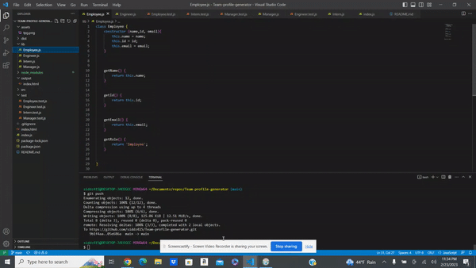
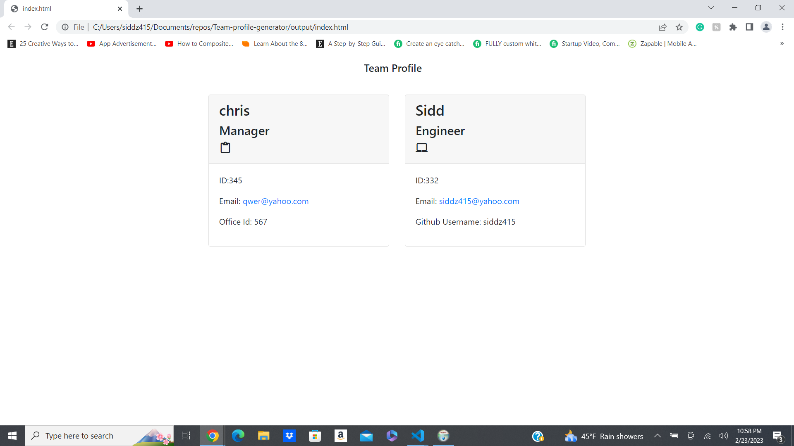

# Team-profile-generator

## Description
This application generates a team profile based on user input using the Inquirer module from Node.js and displaying the information on a newly created html page. This app demonstrates use of Object-oriented programming and Test-driven development using Jest.

## Table of Contents
Installation
Usage
Screenshot
Tests
credits

## Installation
The user should clone the repository from GitHub and download Node.js. This app also requires a file system and inquirer module. This application uses Jest for testing.

## Usage

## Screenshot
 

## Tests
Run npm test to run Jest.

## credits
getBootstrap.com
screenify.com
ezgif.com/video-to-gif
npmjs.com/package/jest
npmjs.com/package/inquirer
